# Big Data Project 2025/26 | Matic Zadobovšek, Matija Bažec

## Getting started (internal instructions)

- Most information regarding our dataset can be found on https://www.nyc.gov/site/tlc/about/tlc-trip-record-data.page website. Always refer to that.
- First you should go through the `Tasks` section below, to see what we have done. You should follow similar structure regarding organization in the next steps as well.
- Work between the two of us is distributed between the tasks, and each task has a team member name written in the title, so you can see who is supposed to do what.
- Project instructions are available in the `instructions.pdf` file.
- Check the `Project structure` section below to see how our project is organized, and how you should continue to save obtained results and code.
- Whenever you complete a task, you should update the `README.md` file with what you did, add key results and images. This will help us with the final report, because we will already have most of the content prepared here.
- On the HPC cluster our work can be found under `/d/hpc/projects/FRI/bigdata/students/mz1034/Project`, but majority of the work is done on Snowflake, and it should remain like that.
- When you prepare visualizations avoid having every word capitalized (This Looks Extremely Ugly).
- When working on Snowflake, you should work within your own workspace, because you can only share workspace with users with the same role, and that would mean everyone would have access to our workspace, which is not ideal. Just make sure to upload your final SQL and other code files to our repository, so we have everything in one place and we can easily run each other's code if needed.

## Project structure

```text
Project/
├── README.md
├── instructions.pdf
│
├── images/
│   ├── t0/
│   │   ├── warehouse.png
│   │   ├── db.png
│   │   ├── schemas.png
│   │   ├── stages.png
│   │   └── tables.png
│   │
│   ├── t1/
│   │   ├── tables.png
│   │   ├── preview_yellow.png
│   │   ├── preview_green.png
│   │   ├── preview_fhv.png
│   │   └── preview_fhvhv.png
│   │
│   └── t2/
│       ├── yellow_chart.png
│       ├── green_chart.png
│       ├── fhv_chart.png
│       └── fhvhv_chart.png
│
└── scripts/
    ├── t0/
    │   ├── missing_data.py
    │   ├── snowflake.py
    │   └── t0.sql
    │
    ├── t1/
    │   └── t1.sql
    │
    └── t2/
        └── t2.sql
```

## Tasks

### T0. MATIC
- In this task we have focused on gathering all the needed information and getting stuff uploaded to Snowflake.
- On the Arnes HPC cluster we have already had data available in the `/d/hpc/projects/FRI/bigdata/data/Taxi` directory, but the files are only available up to January 2025, so our first task was to get the missing files for `yellow`, `green`, `fhv` and `fhvhv` up until February 2026. 
- Under `scripts/t0/missing_data.py`you can see the script that does this, and saves the missing files under the `data_missing` directory on the HPC cluster. Our directory can be accessed under `/d/hpc/projects/FRI/bigdata/students/mz1034/Project`, where you will find the `data_missing` directory and the `t0_missing_data.py` script as well.
- On Snowflake, we have created a warehouse named `BIGDATA_MZMB_WH`, and set up a database named `BIGDATA_TAXI_MZMB`.

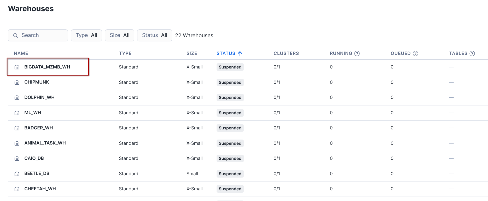

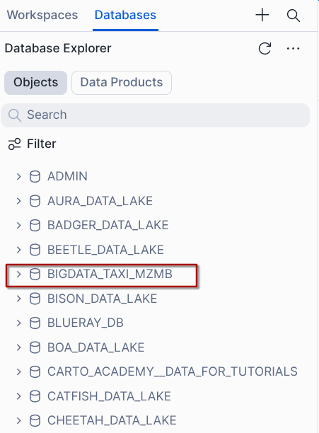
- We have added three schemas to the database: `BRONZE`, `SILVER` and `GOLD`.

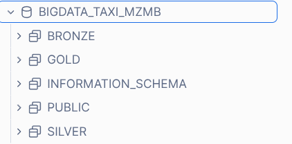
- Now we have used the `t0.sql` script to prepare the 4 stages under the `BRONZE` schema, so we could upload the parquet files to the stages. We have `YELLOW_RAW_STAGE`, `GREEN_RAW_STAGE`, `FHV_RAW_STAGE` and `FHVHV_RAW_STAGE` stages, each for the corresponding taxi data.

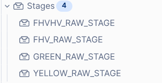
- `scripts/t0/snowflake.py` was then used to upload all the parquet files from the given `/d/hpc/projects/FRI/bigdata/data/Taxi` and `data_missing` directories to the corresponding stages on Snowflake.
- When all parquet files have been uploaded to stages, we have created 4 new tables, which list the column names and their data types. We ended up with `T0_YELLOW_SCHEMA`, `T0_GREEN_SCHEMA`, `T0_FHV_SCHEMA` and `T0_FHVHV_SCHEMA` tables, which are all under the `BRONZE` schema. We have also added `T0_SCHEMA_ALL` table, which does a union of all the previous tables, so we have a complete overview of all the columns and their data types in one place.

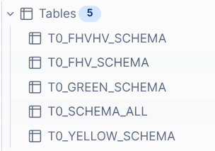
- So far we have done no filtering or transformations, just getting all needed parquet files and uploading them into the `BRONZE` layer on Snowflake, where we have the tables with column names and types, so we can easily compare between files, because there are differences between the attribute names and types, depending on the year of the data.

### T1. MATIC

- Here we have focused on the `SILVER` layer, where we have taken care of schemas and attribute names differences between the files. Everything was performed in Snowflake.
- Main file that we are running is the `scripts/t1/t1.sql` file, which creates the tables in the `SILVER` layer.
- Main result are the 4 tables, `YELLOW_TRIPS`, `GREEN_TRIPS`, `FHV_TRIPS` and `FHVHV_TRIPS`, which are all under the `SILVER` schema. We have taken care of the differences, so these tables are unified and ready for further analysis. Note that we didn't care about the data quality issues here, but only about getting the data in the right format.

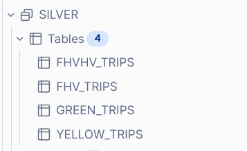
- Data columns that had different formats in original parquet files were unified using the `TRY_TO_DOUBLE` or `TRY_TO_NUMBER` functions.
- If we had different column names for the same attribute (e.g. `airport_fee` vs `Airport_fee`), we used the `COALESCE` function to get the value from the column that is not null, so we have only one column in the `SILVER` layer for each attribute.
- We also added attributes for year and month, which we got from the pickup datetime column.
- `YELLOW_TRIPS` ended up with: 
```sql
create or replace TABLE BIGDATA_TAXI_MZMB.SILVER.YELLOW_TRIPS cluster by (pickup_year, pickup_month)(
	VENDOR_ID NUMBER(38,0),
	PICKUP_DATETIME TIMESTAMP_NTZ(6),
	DROPOFF_DATETIME TIMESTAMP_NTZ(6),
	PASSENGER_COUNT FLOAT,
	TRIP_DISTANCE FLOAT,
	RATECODE_ID FLOAT,
	STORE_AND_FWD_FLAG VARCHAR(16777216),
	PU_LOCATION_ID NUMBER(38,0),
	DO_LOCATION_ID NUMBER(38,0),
	PAYMENT_TYPE NUMBER(38,0),
	FARE_AMOUNT FLOAT,
	EXTRA FLOAT,
	MTA_TAX FLOAT,
	TIP_AMOUNT FLOAT,
	TOLLS_AMOUNT FLOAT,
	IMPROVEMENT_SURCHARGE FLOAT,
	TOTAL_AMOUNT FLOAT,
	CONGESTION_SURCHARGE FLOAT,
	AIRPORT_FEE FLOAT,
	CBD_CONGESTION_FEE FLOAT,
	PICKUP_YEAR NUMBER(4,0),
	PICKUP_MONTH NUMBER(2,0),
	SOURCE_FILE VARCHAR(16777216)
);
```
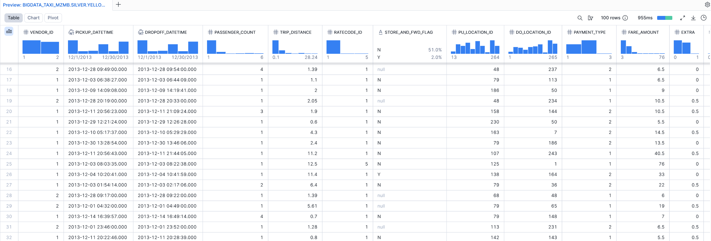
- `GREEN_TRIPS` ended up with:
```sql
create or replace TABLE BIGDATA_TAXI_MZMB.SILVER.GREEN_TRIPS cluster by (pickup_year, pickup_month)(
	VENDOR_ID NUMBER(38,0),
	PICKUP_DATETIME TIMESTAMP_NTZ(6),
	DROPOFF_DATETIME TIMESTAMP_NTZ(6),
	STORE_AND_FWD_FLAG VARCHAR(16777216),
	RATECODE_ID FLOAT,
	PU_LOCATION_ID NUMBER(38,0),
	DO_LOCATION_ID NUMBER(38,0),
	PASSENGER_COUNT FLOAT,
	TRIP_DISTANCE FLOAT,
	FARE_AMOUNT FLOAT,
	EXTRA FLOAT,
	MTA_TAX FLOAT,
	TIP_AMOUNT FLOAT,
	TOLLS_AMOUNT FLOAT,
	EHAIL_FEE FLOAT,
	IMPROVEMENT_SURCHARGE FLOAT,
	TOTAL_AMOUNT FLOAT,
	PAYMENT_TYPE NUMBER(38,0),
	TRIP_TYPE NUMBER(38,0),
	CONGESTION_SURCHARGE FLOAT,
	CBD_CONGESTION_FEE FLOAT,
	PICKUP_YEAR NUMBER(4,0),
	PICKUP_MONTH NUMBER(2,0),
	SOURCE_FILE VARCHAR(16777216)
);
```
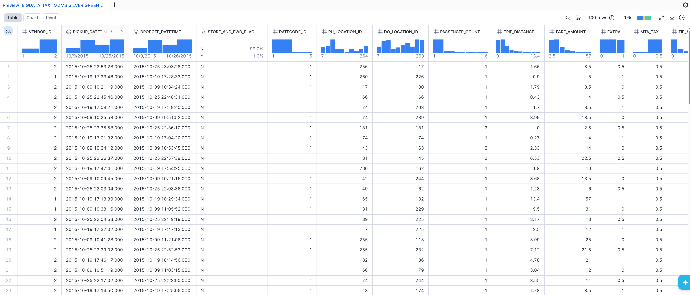
- `FHV_TRIPS` ended up with:
```sql
create or replace TABLE BIGDATA_TAXI_MZMB.SILVER.FHV_TRIPS cluster by (pickup_year, pickup_month)(
	DISPATCHING_BASE_NUM VARCHAR(16777216),
	PICKUP_DATETIME TIMESTAMP_NTZ(9),
	DROPOFF_DATETIME TIMESTAMP_NTZ(9),
	PU_LOCATION_ID NUMBER(38,0),
	DO_LOCATION_ID NUMBER(38,0),
	SR_FLAG NUMBER(38,0),
	AFFILIATED_BASE_NUMBER VARCHAR(16777216),
	PICKUP_YEAR NUMBER(4,0),
	PICKUP_MONTH NUMBER(2,0),
	SOURCE_FILE VARCHAR(16777216)
);
```
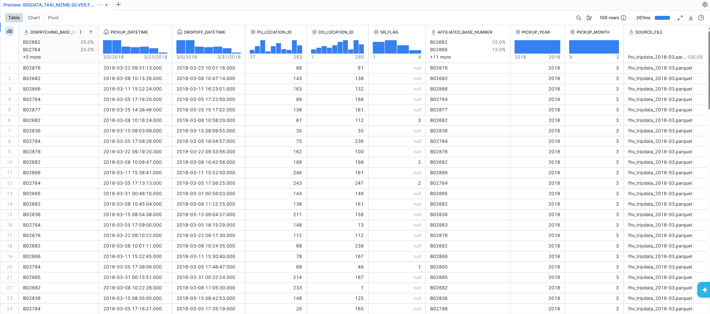
- `FHVHV_TRIPS` ended up with:
```sql
create or replace TABLE BIGDATA_TAXI_MZMB.SILVER.FHVHV_TRIPS cluster by (pickup_year, pickup_month)(
	HVFHS_LICENSE_NUM VARCHAR(16777216),
	DISPATCHING_BASE_NUM VARCHAR(16777216),
	ORIGINATING_BASE_NUM VARCHAR(16777216),
	REQUEST_DATETIME TIMESTAMP_NTZ(6),
	ON_SCENE_DATETIME TIMESTAMP_NTZ(6),
	PICKUP_DATETIME TIMESTAMP_NTZ(6),
	DROPOFF_DATETIME TIMESTAMP_NTZ(6),
	PU_LOCATION_ID NUMBER(38,0),
	DO_LOCATION_ID NUMBER(38,0),
	TRIP_MILES FLOAT,
	TRIP_TIME NUMBER(38,0),
	BASE_PASSENGER_FARE FLOAT,
	TOLLS FLOAT,
	BCF FLOAT,
	SALES_TAX FLOAT,
	CONGESTION_SURCHARGE FLOAT,
	AIRPORT_FEE FLOAT,
	TIPS FLOAT,
	DRIVER_PAY FLOAT,
	SHARED_REQUEST_FLAG VARCHAR(16777216),
	SHARED_MATCH_FLAG VARCHAR(16777216),
	ACCESS_A_RIDE_FLAG VARCHAR(16777216),
	WAV_REQUEST_FLAG VARCHAR(16777216),
	WAV_MATCH_FLAG VARCHAR(16777216),
	CBD_CONGESTION_FEE FLOAT,
	PICKUP_YEAR NUMBER(4,0),
	PICKUP_MONTH NUMBER(2,0),
	SOURCE_FILE VARCHAR(16777216)
);
```
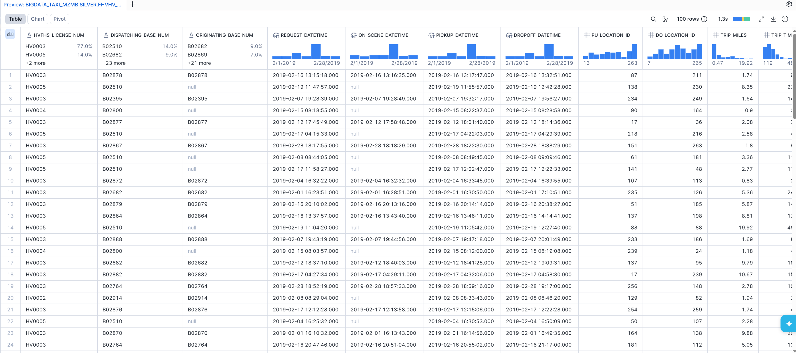

## T2. MATIC

- Here we did the data quality inspection, to check for potential issues in our data.
- Main file that we ran on Snowflake was the `scripts/t2/t2.sql` file.
- Work here went under the `GOLD` layer, where we created 3 new tables for each dataset: `QUALITY_FILE_YEAR`, `QUALITY_YEAR`, `QUALITY_CHART`.
- `QUALITY_FILE_YEAR` is basically the map step, where we calculate the quality statistics for each parquet file and pickup year.
- `QUALITY_YEAR` is the reduce step, where we aggregate those file-level results by year.
- `QUALITY_CHART` is the long format table, where we have `PICKUP_YEAR`, `ISSUE_TYPE`, `ISSUE_COUNT` and `TOTAL_ROWS`, so we can easily visualize the results.
- For charts we mostly used percentages instead of raw counts, because otherwise the biggest datasets/issues completely dominate the visualization.

### T2 results for Yellow Taxi

- For `YELLOW` we were interested in: rows outside the valid range (< 2012 or > 2026), pickup outside source file month (+/- 1 day tolerance), pickup = dropoff, dropoff time < pickup time, trip_distance = 0, passenger_count <= 0, fare_amount < 0, and total_amount < 0.
- We intentionally did not remove rows where `passenger_count` is null, because for many later records this value is missing and it would remove too much data for no good reason. We only treat passenger counts <= 0 as suspicious.
- We noticed that there are some weird pickup years like 2001, 2002, 2008, 2098, etc., but these usually contain a very small number of rows compared to valid years.

|PICKUP_YEAR|TOTAL_ROWS                   |UNEXPECTED_PICKUP_YEAR|PICKUP_OUTSIDE_SOURCE_MONTH                  |PICKUP_EQUALS_DROPOFF|DROPOFF_BEFORE_PICKUP|ZERO_TRIP_DISTANCE|NONPOSITIVE_PASSENGER_COUNT|NEGATIVE_FARE_AMOUNT|NEGATIVE_TOTAL_AMOUNT|
|-----------|-----------------------------|----------------------|---------------------------------------------|---------------------|---------------------|------------------|---------------------------|--------------------|---------------------|
|2001       |27                           |27                    |27                                           |0                    |0                    |4                 |0                          |0                   |0                    |
|2002       |498                          |498                   |498                                          |0                    |0                    |84                |0                          |18                  |18                   |
|2003       |50                           |50                    |50                                           |1                    |0                    |19                |0                          |0                   |0                    |
|2004       |1                            |1                     |1                                            |0                    |0                    |0                 |0                          |0                   |0                    |
|2007       |1                            |1                     |1                                            |0                    |0                    |0                 |0                          |0                   |0                    |
|2008       |771                          |771                   |771                                          |4                    |0                    |42                |0                          |6                   |6                    |
|2009       |1304                         |1304                  |1304                                         |11                   |0                    |77                |0                          |8                   |8                    |
|2010       |1                            |1                     |1                                            |0                    |0                    |0                 |0                          |0                   |0                    |
|2011       |4                            |4                     |4                                            |0                    |0                    |0                 |0                          |0                   |0                    |
|2012       |171359008                    |0                     |1                                            |385642               |1292                 |958564            |1242327                    |0                   |0                    |
|2013       |171816340                    |0                     |0                                            |494450               |10996                |1119568           |4938                       |3080                |3064                 |
|2014       |165447580                    |0                     |1                                            |356083               |8907                 |954350            |7995                       |18523               |18533                |
|2015       |146039232                    |0                     |1                                            |171080               |3917                 |876727            |40683                      |51339               |51353                |
|2016       |131131805                    |0                     |0                                            |141290               |2180                 |773693            |13431                      |55661               |55664                |
|2017       |113500386                    |0                     |5                                            |107007               |1447                 |743181            |166087                     |56091               |56094                |
|2018       |102870524                    |0                     |1905                                         |89333                |1044                 |704268            |933067                     |67781               |67780                |
|2019       |84597309                     |0                     |1344                                         |77873                |1071                 |743602            |1525798                    |170050              |169986               |
|2020       |24649266                     |0                     |902                                          |17401                |20011                |330084            |489385                     |92833               |92683                |
|2021       |30903983                     |0                     |459                                          |21710                |37786                |407782            |703955                     |139322              |139710               |
|2022       |39655622                     |0                     |127                                          |18422                |13613                |573980            |763344                     |252883              |255689               |
|2023       |38310138                     |0                     |247                                          |13094                |2475                 |773445            |583005                     |381649              |376882               |
|2024       |41169691                     |0                     |7                                            |11935                |1575                 |776306            |401354                     |731023              |609343               |
|2025       |48722584                     |0                     |5                                            |544069               |2235                 |1402958           |260062                     |2848621             |973722               |
|2026       |7124754                      |0                     |5                                            |85665                |3                    |248988            |27671                      |66183               |67274                |
|2028       |1                            |1                     |1                                            |0                    |0                    |0                 |0                          |0                   |0                    |
|2029       |7                            |7                     |7                                            |0                    |0                    |1                 |0                          |0                   |0                    |
|2031       |2                            |2                     |2                                            |0                    |0                    |0                 |0                          |0                   |0                    |
|2032       |1                            |1                     |1                                            |0                    |0                    |0                 |0                          |0                   |0                    |
|2033       |3                            |3                     |3                                            |0                    |0                    |0                 |0                          |0                   |0                    |
|2037       |1                            |1                     |1                                            |0                    |0                    |0                 |0                          |0                   |0                    |
|2038       |4                            |4                     |4                                            |0                    |0                    |0                 |0                          |0                   |0                    |
|2041       |3                            |3                     |3                                            |0                    |0                    |0                 |0                          |0                   |0                    |
|2042       |1                            |1                     |1                                            |0                    |0                    |0                 |0                          |0                   |0                    |
|2053       |2                            |2                     |2                                            |1                    |0                    |1                 |0                          |0                   |0                    |
|2058       |3                            |3                     |3                                            |0                    |0                    |0                 |0                          |0                   |0                    |
|2066       |1                            |1                     |1                                            |0                    |0                    |0                 |0                          |0                   |0                    |
|2070       |1                            |1                     |1                                            |0                    |0                    |1                 |0                          |0                   |0                    |
|2084       |8                            |8                     |8                                            |0                    |0                    |0                 |0                          |0                   |0                    |
|2088       |2                            |2                     |2                                            |0                    |0                    |0                 |0                          |0                   |0                    |
|2090       |1                            |1                     |1                                            |0                    |0                    |0                 |0                          |0                   |0                    |
|2098       |1                            |1                     |1                                            |0                    |0                    |0                 |0                          |0                   |0                    |

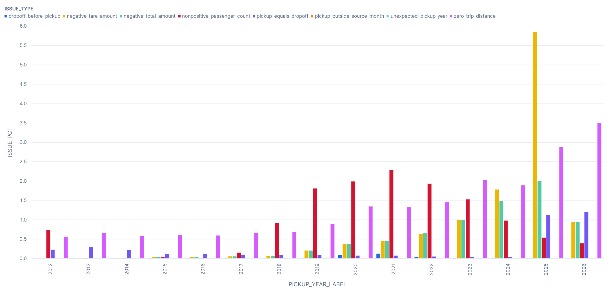

- Based on this, we created `SILVER.YELLOW_TRIPS_CLEAN`. This view keeps only rows with:
  - pickup year between 2012 and 2026,
  - pickup time within the expected source file month (+/- 1 day),
  - dropoff after pickup,
  - trip distance > 0,
  - non-negative fare and total amount,
  - passenger count either null or > 0.

### T2 results for Green Taxi

- For `GREEN` we used almost the same checks as for Yellow, but with the valid year range changed to 2014-2026.
- Checks used: rows outside the valid range (< 2014 or > 2026), pickup outside source file month (+/- 1 day tolerance), pickup = dropoff, dropoff time < pickup time, trip_distance = 0, passenger_count <= 0, fare_amount < 0, and total_amount < 0.
- Results are generally similar to Yellow, but the dataset is much smaller.
- We again saw some weird years outside the expected range, but the number of such rows is very small.

|PICKUP_YEAR|TOTAL_ROWS|UNEXPECTED_PICKUP_YEAR|PICKUP_OUTSIDE_SOURCE_MONTH|PICKUP_EQUALS_DROPOFF|DROPOFF_BEFORE_PICKUP|ZERO_TRIP_DISTANCE|NONPOSITIVE_PASSENGER_COUNT|NEGATIVE_FARE_AMOUNT|NEGATIVE_TOTAL_AMOUNT|
|-----------|----------|----------------------|---------------------------|---------------------|---------------------|------------------|---------------------------|--------------------|---------------------|
|2008       |115       |115                   |115                        |1                    |0                    |22                |0                          |1                   |1                    |
|2009       |315       |315                   |315                        |1                    |0                    |39                |0                          |3                   |3                    |
|2010       |348       |348                   |348                        |1                    |0                    |17                |0                          |1                   |1                    |
|2012       |3         |3                     |3                          |0                    |0                    |0                 |0                          |0                   |0                    |
|2014       |15837009  |0                     |0                          |9978                 |202                  |241457            |3346                       |11626               |11626                |
|2015       |19233765  |0                     |0                          |12831                |259                  |273839            |6100                       |30852               |30854                |
|2016       |16385541  |0                     |0                          |11225                |101                  |218030            |4375                       |32982               |32985                |
|2017       |11736906  |0                     |321                        |6640                 |51                   |135719            |1842                       |26636               |26636                |
|2018       |8899314   |0                     |519                        |5477                 |28                   |103608            |12371                      |23060               |23055                |
|2019       |6300814   |0                     |167                        |14270                |302                  |138590            |11688                      |19906               |19879                |
|2020       |1734166   |0                     |30                         |2448                 |94                   |64464             |3199                       |4422                |4415                 |
|2021       |1068729   |0                     |15                         |1212                 |2                    |40486             |1431                       |2090                |2114                 |
|2022       |840394    |0                     |126                        |1500                 |1                    |49391             |3517                       |2163                |2195                 |
|2023       |787055    |0                     |76                         |1033                 |0                    |39493             |6143                       |2217                |2239                 |
|2024       |660204    |0                     |61                         |659                  |2                    |34573             |6792                       |2143                |2173                 |
|2025       |591369    |0                     |76                         |566                  |1344                 |24439             |8256                       |1736                |1774                 |
|2026       |77655     |0                     |6                          |53                   |1                    |2676              |1129                       |225                 |228                  |
|2030       |2         |2                     |2                          |0                    |0                    |0                 |0                          |0                   |0                    |
|2035       |1         |1                     |1                          |0                    |0                    |1                 |0                          |0                   |0                    |
|2041       |1         |1                     |1                          |0                    |0                    |1                 |0                          |0                   |0                    |
|2062       |1         |1                     |1                          |0                    |0                    |1                 |0                          |0                   |0                    |
|2081       |1         |1                     |1                          |0                    |0                    |0                 |0                          |0                   |0                    |

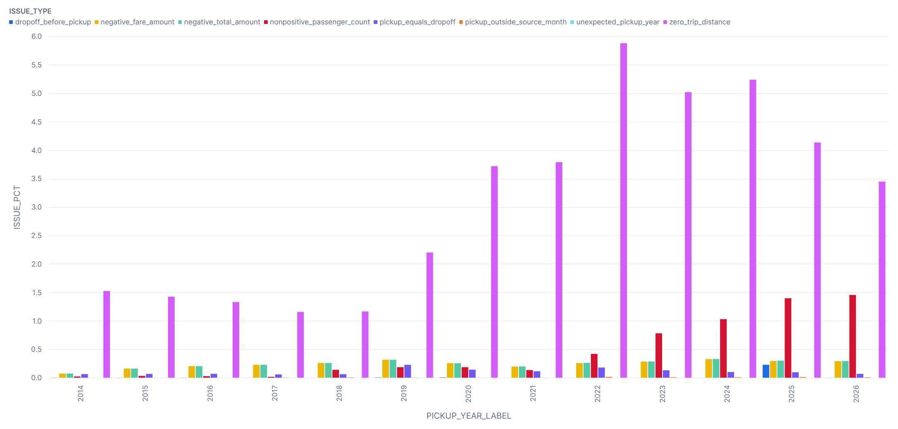

- Based on this, we created `SILVER.GREEN_TRIPS_CLEAN`, using the same cleaning logic as Yellow, but with the valid year range set to 2014-2026.

### T2 results for FHV

- `FHV` has fewer columns than Yellow and Green, so there are fewer possible checks.
- For `FHV` we checked: rows outside the valid range (< 2015 or > 2026), pickup outside source file month (+/- 1 day tolerance), pickup = dropoff, dropoff time < pickup time, missing pickup location, missing dropoff location, and missing dispatching base.
- The results for FHV are different from the other datasets. Pickup timestamps are mostly fine, but dropoff timestamps are very problematic in the early years. For example, many rows in 2015 and 2016 have dropoff times before pickup times.
- We also saw a lot of missing pickup/dropoff locations, especially in older years.
- Because of this, we decided not to use one very strict clean view for all FHV analyses. If we filtered out every row with bad dropoff time or missing location, we would lose a huge amount of data.

|PICKUP_YEAR|TOTAL_ROWS|UNEXPECTED_PICKUP_YEAR|PICKUP_OUTSIDE_SOURCE_MONTH|PICKUP_EQUALS_DROPOFF|DROPOFF_BEFORE_PICKUP|MISSING_PICKUP_LOCATION|MISSING_DROPOFF_LOCATION|MISSING_DISPATCHING_BASE|
|-----------|----------|----------------------|---------------------------|---------------------|---------------------|-----------------------|------------------------|------------------------|
|2015       |63388532  |0                     |0                          |0                    |63387762             |17281411               |62151232                |0                       |
|2016       |132114083 |0                     |0                          |0                    |132112979            |39844413               |130428240               |0                       |
|2017       |192309557 |0                     |0                          |0                    |72807164             |42022338               |84283342                |1                       |
|2018       |260874754 |0                     |1                          |205                  |7509                 |37266902               |20000408                |49                      |
|2019       |43261276  |0                     |0                          |12                   |66                   |2024082                |723705                  |3                       |
|2020       |14945465  |0                     |0                          |0                    |0                    |3573702                |591444                  |0                       |
|2021       |14805265  |0                     |0                          |0                    |0                    |12106088               |2183776                 |0                       |
|2022       |14511664  |0                     |0                          |0                    |0                    |11020778               |2311546                 |0                       |
|2023       |15858639  |0                     |0                          |0                    |1                    |12333652               |2793673                 |0                       |
|2024       |17630326  |0                     |0                          |0                    |0                    |14015589               |2915588                 |0                       |
|2025       |24860987  |0                     |0                          |44                   |292                  |20391429               |4199778                 |0                       |
|2026       |1941722   |0                     |0                          |0                    |1                    |1646462                |216251                  |0                       |

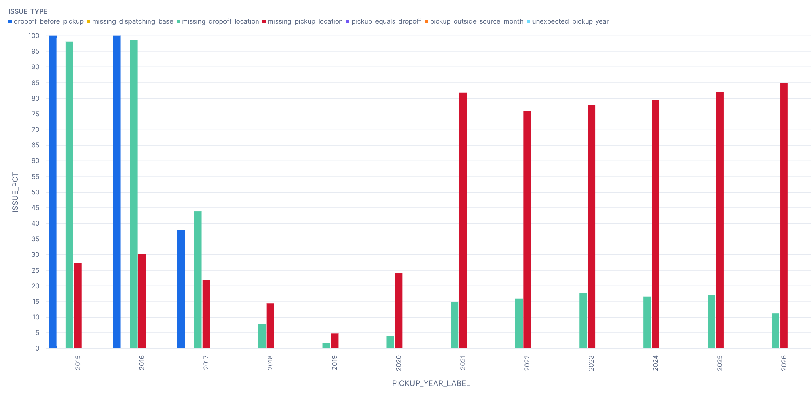


- We created a lighter default clean view `SILVER.FHV_TRIPS_CLEAN`.
- This view only keeps rows with:
  - pickup year between 2015 and 2026,
  - pickup time within the expected source file month (+/- 1 day),
  - non-empty dispatching base number.
- This way we do not throw away too much FHV data too early.

### T2 results for FHVHV

- `FHVHV` has many more useful columns than FHV, so we can check more things.
- For `FHVHV` we checked: rows outside the valid range (< 2019 or > 2026), pickup outside source file month (+/- 1 day tolerance), pickup = dropoff, dropoff time < pickup time, trip_miles <= 0, trip_time <= 0, base_passenger_fare < 0, driver_pay < 0, missing pickup/dropoff location, and missing base information.
- Compared to FHV, this dataset looks much cleaner.
- Pickup years and source months are consistent, missing locations are basically not an issue, and most problems are very small compared to the total number of rows.

|PICKUP_YEAR|TOTAL_ROWS|UNEXPECTED_PICKUP_YEAR|PICKUP_OUTSIDE_SOURCE_MONTH|PICKUP_EQUALS_DROPOFF|DROPOFF_BEFORE_PICKUP|NONPOSITIVE_TRIP_MILES|NONPOSITIVE_TRIP_TIME|NEGATIVE_BASE_PASSENGER_FARE|NEGATIVE_DRIVER_PAY|MISSING_LOCATION|MISSING_BASE_INFO|
|-----------|----------|----------------------|---------------------------|---------------------|---------------------|----------------------|---------------------|----------------------------|-------------------|----------------|-----------------|
|2019       |234630264 |0                     |0                          |1804                 |7926                 |514155                |16843                |594752                      |653                |0               |2085             |
|2020       |143309871 |0                     |0                          |452                  |7444                 |152429                |669                  |165773                      |1587               |0               |0                |
|2021       |174596652 |0                     |0                          |613                  |7558                 |53147                 |953                  |200924                      |11221              |0               |0                |
|2022       |212416083 |0                     |0                          |10                   |8569                 |43445                 |9                    |233608                      |2678               |0               |0                |
|2023       |232490020 |0                     |0                          |26                   |8481                 |40779                 |26                   |68532                       |2936               |0               |0                |
|2024       |239470448 |0                     |0                          |27                   |9653                 |34059                 |30                   |18233                       |1868               |0               |0                |
|2025       |243589684 |0                     |0                          |27                   |12204                |28128                 |31                   |13495                       |875                |0               |0                |
|2026       |40816059  |0                     |0                          |1                    |0                    |4802                  |861                  |34110                       |59                 |0               |0                |

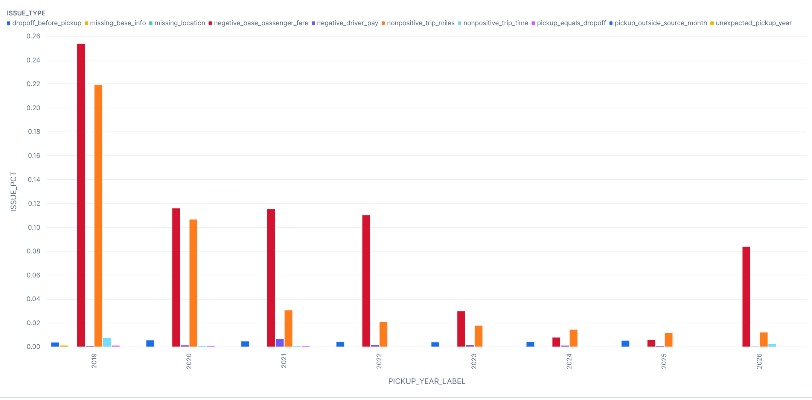

- Because FHVHV quality is much better, we created `SILVER.FHVHV_TRIPS_CLEAN` with stricter filtering.
- This view keeps only rows with:
  - pickup year between 2019 and 2026,
  - pickup time within the expected source file month (+/- 1 day),
  - dropoff after pickup,
  - trip_miles > 0,
  - trip_time > 0,
  - non-negative base passenger fare and driver pay,
  - non-null pickup/dropoff locations,
  - non-empty license/base information.

### Clean views created after T2

- After T2 we created clean views in the `SILVER` layer, because they are cleaned reusable trip-level datasets that will be used by later tasks.
- We did not put these views in `GOLD`, because `GOLD` is mostly used for aggregated outputs, charts, and final analysis tables.

- These views will be the main starting point for later exploratory analysis, augmentation, ML and other tasks.

### T3. MATIJA

- Introductory exploratory data analysis for all four datasets, starting from the cleaned `SILVER` views created in T2.
- All aggregations are stored in the `GOLD` schema. SQL is in `scripts/t3/t3.sql`, visualizations in `scripts/t3/t3_visualizations.ipynb`.
- Analyses cover: temporal aggregations (year-month, hour of day, day of week), spatial aggregations (top pickup/dropoff locations and OD pairs), trip characteristics (distance, duration, fare), COVID-19 impact, payment types, Uber vs Lyft breakdown, and cross-dataset similarity.

#### Dataset overview

| Dataset | Total trips | Years |
|---------|------------|-------|
| Yellow taxi | 1.29B | 2012–2026 |
| Green taxi | 0.08B | 2014–2026 |
| FHV | 0.80B | 2015–2026 |
| FHVHV (Uber/Lyft) | 1.52B | 2019–2026 |

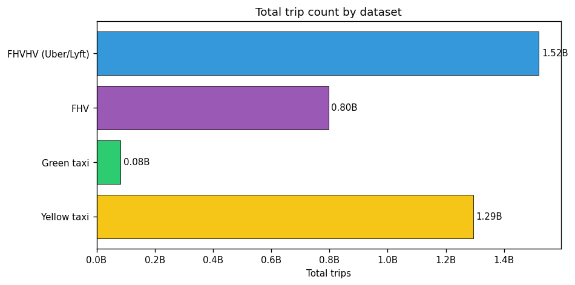

#### Temporal analysis

- Monthly volume shows clear structural shifts: Yellow taxi declining steadily from ~15M/month in 2012 to ~3–4M today, FHV peaking around 2019 and collapsing after the FHVHV regulation (Feb 2019) took effect, and FHVHV taking over as the dominant mode after 2019. The COVID-19 crash in March–April 2020 is visible across all datasets.

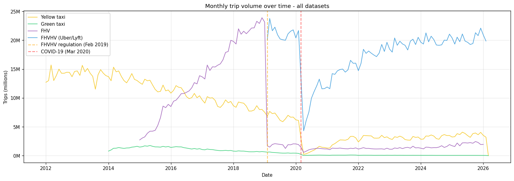

- Hourly patterns are nearly identical across all four datasets: minimum at ~5am, morning peak at 8am, and a broader evening peak at 18–19h. Normalized cosine similarity between all pairs is ≥ 0.99.

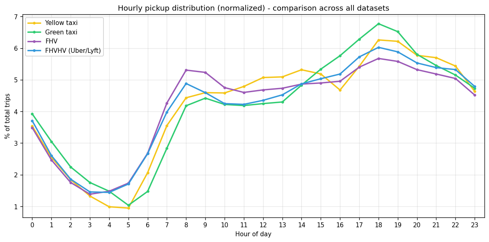

- Day-of-week distributions are also very consistent: Friday and Saturday are the busiest days across all datasets, Monday is the quietest. All pairwise cosine similarities are 1.00.

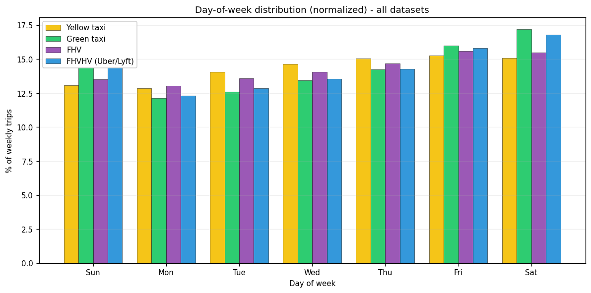

#### COVID-19 impact analysis

- All datasets dropped sharply from March 2020. Yellow and Green each lost ~90–95% of trips in April 2020 compared to April 2019. FHVHV dropped ~80%. FHV shows an unusual 2019 baseline because most FHV data in 2019 is from January only (regulatory cutoff).

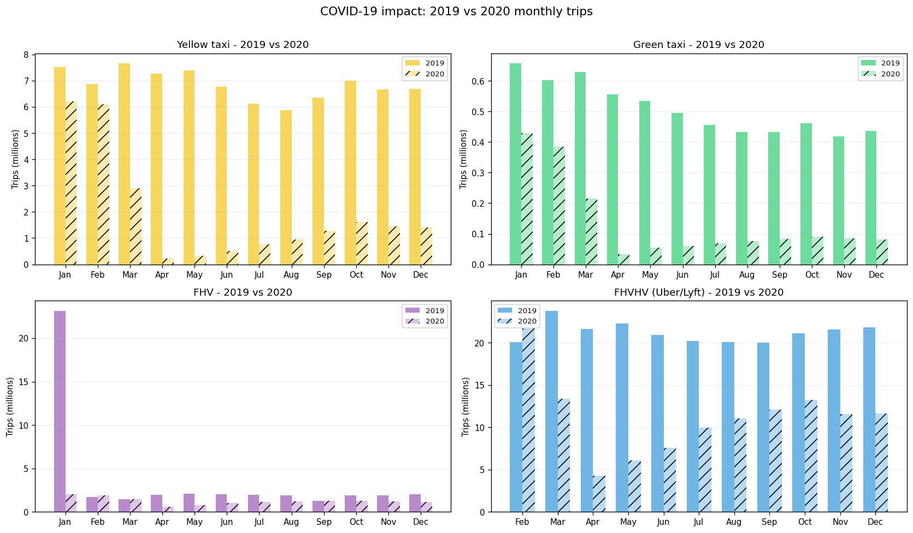

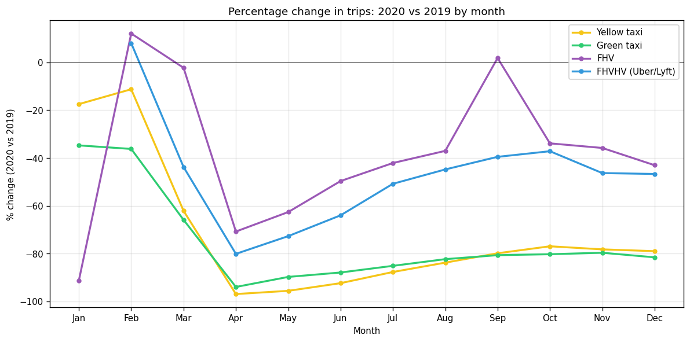

#### Spatial analysis

- Yellow taxi pickups are concentrated in Manhattan (top zones: 237, 161, 236, 162, 230). Green taxi is almost exclusively in the outer boroughs (top zones: 74, 75, 41, 97). FHV and FHVHV have a much wider geographic spread, with zone 264 (unknown/outside NYC) dominating FHV early years.
- Yellow–Green spatial cosine similarity is only 0.08 — they serve almost entirely different parts of the city.

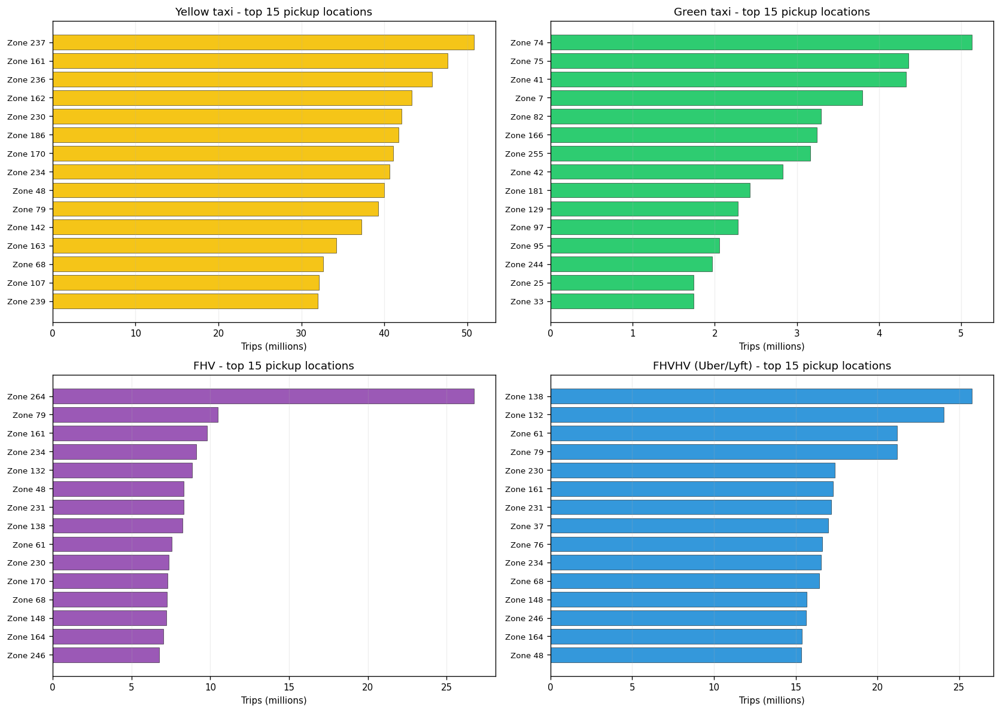

- Top OD pairs reveal self-loops (same zone pickup and dropoff) are very common, especially for Yellow (264→264: ~16M trips) and FHV (264→265: ~9M). Green taxi shows more local neighborhood patterns in the outer boroughs.

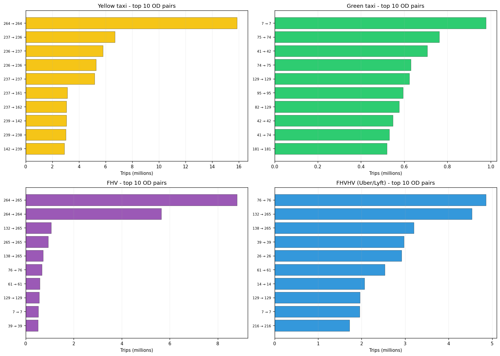

#### Trip characteristics

- Average fare and total amount have increased significantly over time for all datasets, especially from 2022 onwards. Yellow and Green maintain similar per-trip distances (~2.5–3 miles), while FHVHV averages slightly longer trips. Average trip duration is roughly 15–20 minutes across all three datasets.

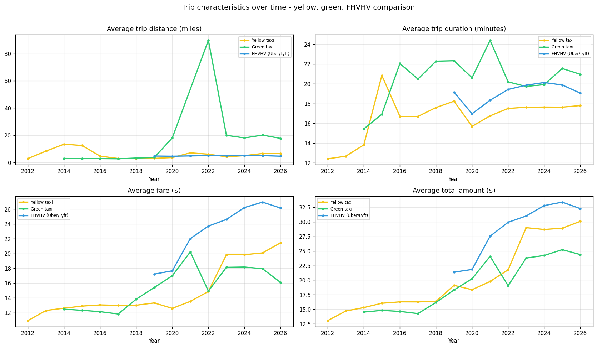

#### Payment type distribution

- Yellow taxi: 62.9% credit card, 35.1% cash. Green taxi is almost evenly split: 50.1% cash, 49.4% credit card — reflecting the different customer base in outer boroughs where cash use is higher.

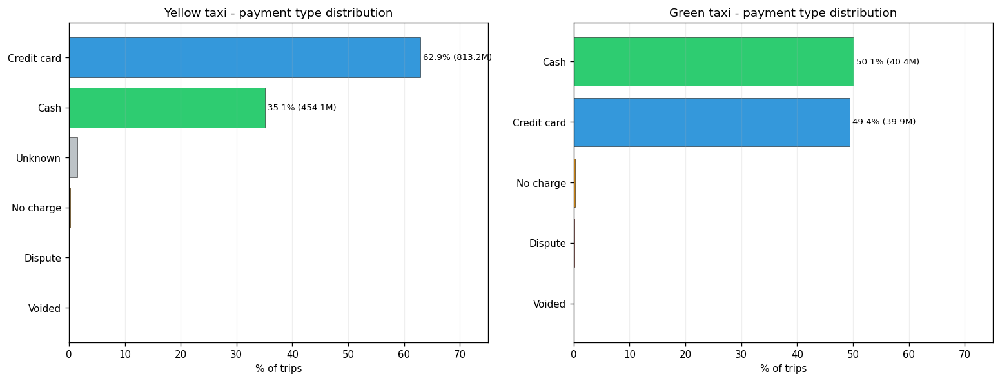

#### Uber vs Lyft (FHVHV)

- Uber (`HV0003`) dominates throughout, with Lyft (`HV0005`) holding a smaller share. Both providers show similar trends in average distance, duration, and fare. Driver pay and tips for both have grown steadily since 2021.

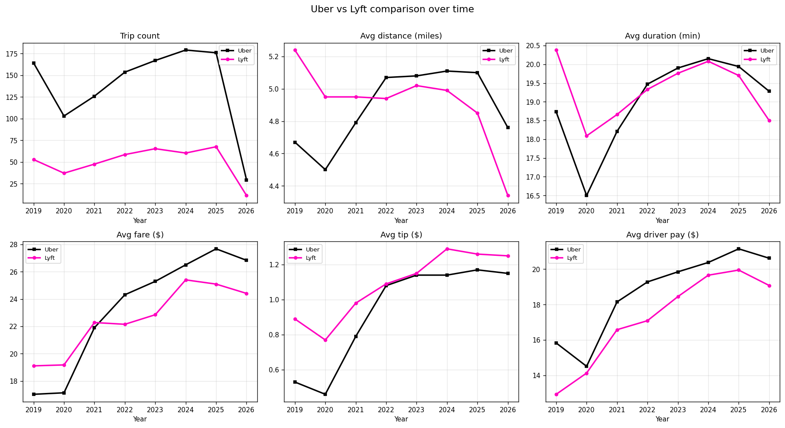

#### Cross-dataset similarity

- Similarity was measured across four metrics: cosine similarity on hourly distributions, day-of-week distributions, and pickup location distributions, plus Pearson correlation on monthly trip volumes.
- **Temporal patterns (hourly and DOW)** are essentially identical across all four datasets — all cosine similarities ≥ 0.99.
- **Spatial distributions** differ significantly: Yellow–Green similarity is 0.08 (completely different service areas), while FHV–FHVHV is 0.85 (strongly overlapping).
- **Monthly volume correlation**: Yellow–Green have the highest Pearson correlation (0.95), as both are regulated taxi services declining together. FHVHV–Green have the lowest (0.33), as they operate in opposite directions over time.
- Overall, FHV and FHVHV are the most similar pair (avg 0.878), while FHVHV and Green are the least similar (avg 0.701).

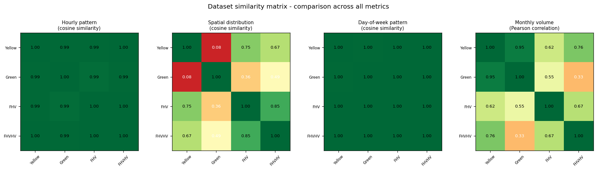

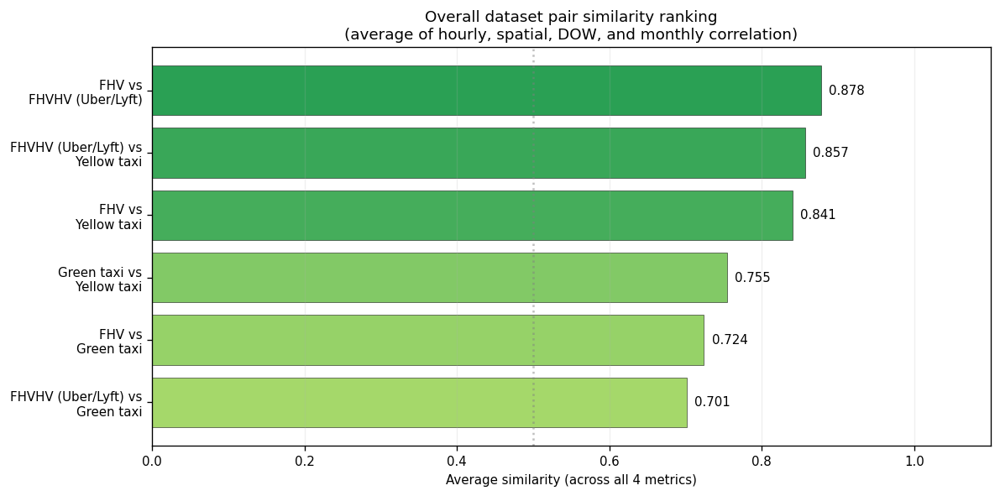


### T4. MATIJA

- Storage format benchmark on the Green taxi 2024 partition (`SILVER.GREEN_TRIPS_CLEAN WHERE PICKUP_YEAR = 2024`, 617,885 rows).
- Snowflake does not support HDF5 or DuckDB natively, so the comparison is split: Parquet, CSV, and CSV (gzip) were benchmarked in both Snowflake (`t4.sql`) and Python (`t4_benchmark.ipynb`), while HDF5 was Python-only.
- **Measurement methodology:**
  - *Python*: write time is a single run; read time is the median of 3 full `pd.read_*` calls loading the entire file into a DataFrame.
  - *Snowflake*: write time is the `COPY INTO @stage` duration; read time is a `COUNT(*) FROM @stage/<format>/` query, pulled from `INFORMATION_SCHEMA.QUERY_HISTORY`. `COUNT(*)` forces a full file scan (every byte must be decompressed and parsed to count rows) without sending data back to the client, making it a clean format-vs-format comparison. `SELECT *` was not used for staged CSV files because CSV has no embedded schema — the engine cannot infer column names from the file alone, requiring positional `$1,$2,...` references. Parquet embeds its schema so `SELECT *` would work there, but `COUNT(*)` keeps the benchmark consistent across formats.
  - Results are saved to `GOLD.T4_FORMAT_COMPARISON`.

#### Results

| Format | File size (MB) | Read time (s) | Write time (s) |
|--------|---------------|--------------|----------------|
| Parquet (snappy) [Python] | 15.07 | **0.11** | 0.82 |
| CSV [Python] | 90.45 | 1.21 | 6.84 |
| CSV (gzip) [Python] | **13.18** | 1.40 | 18.48 |
| HDF5 (h5py/gzip) [Python] | 38.92 | 0.30 | 0.95 |
| Parquet (snappy) [Snowflake] | 14.45 | 0.42 | 2.12 |
| CSV [Snowflake] | 94.57 | 0.52 | 2.86 |
| CSV (gzip) [Snowflake] | 13.99 | 0.60 | 3.23 |

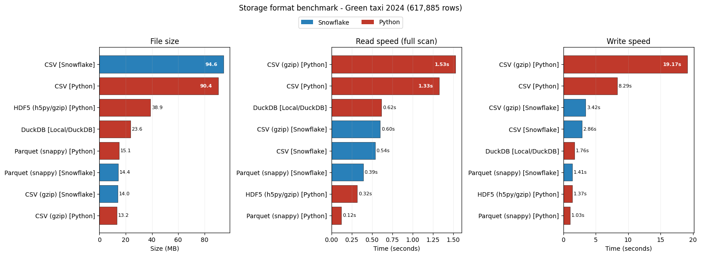

#### Key findings

- **Parquet (snappy)** is the best all-round format: near-smallest size (~15 MB), fastest read in Python (0.11s, ~11× faster than CSV), and fast write (0.82s). It is the clear winner for analytical workloads.
- **CSV (gzip)** achieves the smallest file size (~13–14 MB) but at the cost of the slowest write in Python (18.5s — gzip compression is expensive) and slower reads than Parquet due to decompression. Good for archival, poor for repeated reads.
- **Plain CSV** is the largest format (~90–95 MB, 6× bigger than Parquet) with no speed advantage — strictly dominated by the alternatives.
- **HDF5** offers a reasonable middle ground (38.9 MB, 0.30s read) but is Python-only and unavailable in Snowflake, limiting its usefulness in this pipeline.
- **Snowflake vs Python**: Snowflake read times (0.42–0.60s) are slower than Python reads for the same formats, reflecting network and query planning overhead. However, Snowflake write times are tighter across formats (2.1–3.2s range) since the bottleneck shifts to cluster I/O rather than local compression.

### T5. MATIJA

- Each of the four cleaned trip tables (`YELLOW`, `GREEN`, `FHV`, `FHVHV`) was enriched with external data: weather, schools, attractions, and events.
- All external data lives in a dedicated `EXTERNAL_DATA` schema. Scripts are split across three files: `scripts/t5/t5_fetch_data.sql` (data fetching), `scripts/t5/t5.sql` (spatial joins and event expansion), and `scripts/t5/t5_gold.sql` (final enriched GOLD tables).
- Two taxi zone reference tables were set up in `EXTERNAL_DATA`:
  - `TAXI_ZONE_LOOKUP` — the standard TLC taxi zone lookup CSV (downloaded directly from the TLC website), uploaded to Snowflake as-is. Provides `LOCATION_ID`, `BOROUGH`, `ZONE`, and `SERVICE_ZONE`.
  - `TAXI_ZONES_GEOM` — geometry table for spatial joins. The TLC taxi zone shapefile was downloaded and converted locally using `scripts/t5/convert_taxi.ipynb`: the shapefile is reprojected to EPSG:4326, each polygon's geometry is serialized to WKT, and the result is exported as `taxi_zones_wkt.csv` (columns: `location_id`, `borough`, `zone`, `wkt`). This CSV was then uploaded to Snowflake and the `wkt` column parsed into a `GEOM` column using `TO_GEOGRAPHY`.

#### External data sources

| Table | Source | Content | Link key |
|-------|--------|---------|----------|
| `T5_WEATHER` | Open-Meteo archive API | Daily max/min temp (°C), precipitation (mm) for NYC, 2012–2025 | `DATE` → trip pickup date |
| `T5_SCHOOLS_RAW` → `T5_SCHOOLS_BY_ZONE` | NYC Open Data (`n3p6-zve2`) | Primary and high schools with lat/lon, spatially joined to taxi zones | `PU_LOCATION_ID` |
| `T5_ATTRACTIONS_RAW` → `T5_ATTRACTIONS_BY_ZONE` | NYC Open Data (`fn6f-htvy`) | Museums and cultural institutions, spatially joined to taxi zones | `PU_LOCATION_ID` |
| `T5_EVENTS` → `T5_EVENTS_HOURLY` | NYC Open Data (`bkfu-528j`) | Permitted public events 2020–2024 by borough and datetime | `HOUR(PICKUP_DATETIME)` + `BOROUGH` |

#### Data fetching

- All four external datasets were fetched using Python stored procedures defined directly in Snowflake (`EXTERNAL_DATA.FETCH_WEATHER`, `FETCH_EVENTS`, `FETCH_SCHOOLS`, `FETCH_ATTRACTIONS`), using the `ALLOW_ALL_EAI` external access integration.
- Weather was pulled in 3-year chunks to avoid API limits.
- Events were pulled quarter by quarter (2020–2024) to stay within the 10,000-row API limit per request.

#### Spatial joins and event expansion

- Schools and attractions were joined to taxi zones using `ST_CONTAINS(zone_geom, ST_POINT(lon, lat))`, producing a count per zone:
  - `T5_SCHOOLS_BY_ZONE`: school count per taxi zone
  - `T5_ATTRACTIONS_BY_ZONE`: attraction count per taxi zone
- Events were expanded hour-by-hour across their duration (defaulting to 3 hours when no end time is present), then aggregated to an active event count per hour and borough (`T5_EVENTS_HOURLY`).

#### Final GOLD tables

- `t5_gold.sql` joins all external data onto the four cleaned trip views and materializes four enriched tables in `GOLD`:
  - `GOLD.T5_YELLOW`, `GOLD.T5_GREEN`, `GOLD.T5_FHV`, `GOLD.T5_FHVHV`
- Each table contains all original trip columns plus:

| Column | Description |
|--------|-------------|
| `BOROUGH`, `ZONE`, `SERVICE_ZONE` | From `TAXI_ZONE_LOOKUP` by pickup location |
| `TEMP_MAX_C`, `TEMP_MIN_C` | Daily temperature at pickup date |
| `PRECIPITATION_MM` | Daily precipitation at pickup date |
| `SCHOOL_COUNT` | Number of schools in the pickup zone |
| `ATTRACTION_COUNT` | Number of attractions in the pickup zone |
| `ACTIVE_EVENTS` | Number of permitted events active during the pickup hour in the pickup borough |

- The gold tables were created on a `LARGE` warehouse due to the size of the joins, then scaled back to `XSMALL` afterwards.

### T6. MATIC

- In this task we performed stream processing on Yellow Taxi and FHVHV data.
- The main idea was to treat historical trip records as a stream, by replaying them in pickup timestamp order through Kafka.

#### Streaming architecture

- The full streaming pipeline is:

```text
Snowflake clean source table
→ Python producer
→ Kafka topics
→ Snowflake Kafka Connector / Snowpipe Streaming
→ Snowflake landing table
→ parsed stream view
→ rolling statistics in Snowflake
```

- We also implemented a custom Python consumer for stream clustering:

```text
Kafka topics
→ Python consumer
→ BIRCH stream clustering
→ CSV outputs
→ Snowflake GOLD tables
```

- The Docker/Kafka setup is in `scripts/t6/docker-compose.yaml`.
- It contains two Kafka brokers, and Kafka Connect.
- Kafka Connect was used to run the Snowflake Kafka Connector.
- We used two Kafka topics:
  - `t6-yellow-2021`
  - `t6-fhvhv-2021`
- Using two topics helped us keep the original data sources logically separated during streaming. This makes it easier to replay, debug and monitor Yellow and FHVHV messages independently.
- Both topics were still mapped into the same Snowflake landing table, so the data was combined for analysis.

#### Snowflake source and landing tables

- First, we created `GOLD.T6_STREAM_SOURCE_2021`, which combines Yellow Taxi and FHVHV trips into one common schema.
- This table was created from:
  - `SILVER.YELLOW_TRIPS_CLEAN`
  - `SILVER.FHVHV_TRIPS_CLEAN`
  - `EXTERNAL_DATA.TAXI_ZONES`
- We added a `dataset` column, so every row still keeps information about whether it came from Yellow or FHVHV.
- We also added `stream_id`, which is based on pickup timestamp ordering. This allows us to recover the intended stream order even though we used two Kafka topics.
- The Python producer in `scripts/t6/producer_t6_2021.py` reads ordered rows from Snowflake and sends each row as a JSON message to Kafka.
- Yellow rows are sent to `t6-yellow-2021`, and FHVHV rows are sent to `t6-fhvhv-2021`.
- The Snowflake Kafka Connector then ingests both Kafka topics into:

```sql
GOLD.T6_KAFKA_LANDING_2021
```

- This table contains:
  - `RECORD_CONTENT` — the actual JSON trip message,
  - `RECORD_METADATA` — Kafka metadata such as topic, partition and offset.
- We then created `GOLD.T6_STREAM_EVENTS_2021`, which parses the JSON into normal typed columns.

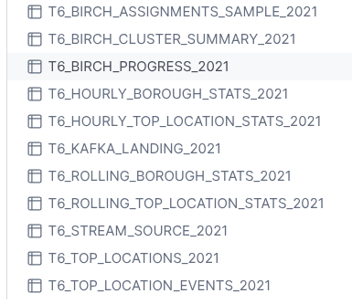

#### Rolling descriptive statistics

- For rolling statistics, we first aggregated the stream into hourly buckets.
- Then we computed a rolling 24-hour window using the current hour and previous 23 hourly buckets.
- This was chosen because taxi demand has strong daily patterns, so a 24-hour rolling window gives smoother and more meaningful statistics than looking at only one hour.
- For each group we calculated:
  - rolling trip count,
  - rolling mean trip distance,
  - rolling standard deviation of trip distance,
  - rolling mean trip duration,
  - rolling standard deviation of trip duration,
  - rolling mean fare amount,
  - rolling standard deviation of fare amount.
- These statistics were calculated for three attributes:
  - `trip_distance`,
  - `trip_duration_sec`,
  - `fare_amount`.

##### Borough rolling statistics

- For boroughs, we created:
  - `GOLD.T6_HOURLY_BOROUGH_STATS_2021`
  - `GOLD.T6_ROLLING_BOROUGH_STATS_2021`
- The rolling statistics are grouped by borough and dataset.
- We kept the `dataset` column because it lets us compare Yellow Taxi and FHVHV behavior separately, while still using one combined stream.

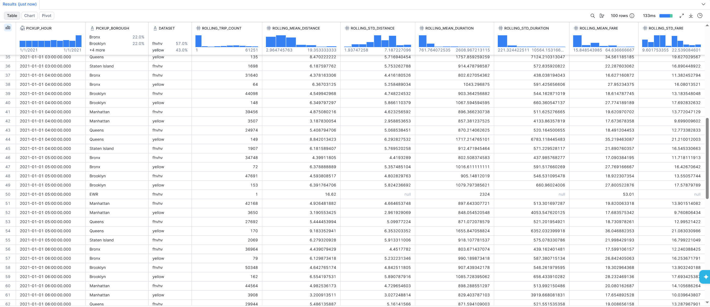

##### Top 10 location rolling statistics

- We also selected the top 10 most interesting locations based on the highest number of pickups and dropoffs in the streamed sample.
- Special zones such as `Outside of NYC`, `N/A` and `Unknown` were excluded from the top location analysis, because they are not real taxi zones.
- For this part we created:
  - `GOLD.T6_TOP_LOCATIONS_2021`
  - `GOLD.T6_TOP_LOCATION_EVENTS_2021`
  - `GOLD.T6_HOURLY_TOP_LOCATION_STATS_2021`
  - `GOLD.T6_ROLLING_TOP_LOCATION_STATS_2021`
- We kept `location_role`, which tells us whether the location was used as a pickup or dropoff location.
- This makes the results more informative, because some zones are more important for pickups and others for dropoffs.

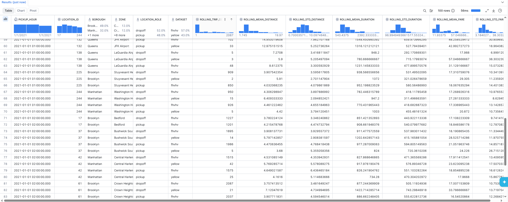

#### Stream clustering with BIRCH

- For stream clustering, we implemented a custom Python Kafka consumer in:

```text
scripts/t6/consumer_t6_birch_2021.py
```

- The consumer subscribes to both Kafka topics and processes messages in micro-batches.
- We used the BIRCH clustering algorithm, because it supports incremental fitting with `partial_fit`.
- This is useful for streaming, because the model does not need to store the full stream in memory.
- BIRCH builds a compact clustering-feature tree while the stream is being consumed.
- Each Kafka message was transformed into numeric features:
  - dataset flag,
  - hour of day,
  - day of week,
  - pickup location,
  - dropoff location,
  - trip distance,
  - trip duration,
  - fare amount.
- Hour and day of week were encoded cyclically, because for example hour 23 and hour 0 are close in time.
- Distance, duration and fare were log-scaled, so extreme values do not dominate the clustering too much.
- During the stream, BIRCH was trained with `n_clusters=None`, so it could build its internal subclusters.
- At the end we set `n_clusters = 6`, so the internal subclusters were summarized into 6 final clusters.
- The number 6 was chosen because it is small enough to interpret, but still large enough to separate different trip patterns.

- The clustering outputs were saved as CSV files:
  - `t6_birch_cluster_summary_2021.csv`
  - `t6_birch_assignments_sample_2021.csv`
  - `t6_birch_progress_2021.csv`
- We also uploaded the most important results back to Snowflake:
  - `GOLD.T6_BIRCH_CLUSTER_SUMMARY_2021`
  - `GOLD.T6_BIRCH_ASSIGNMENTS_SAMPLE_2021`
  - `GOLD.T6_BIRCH_PROGRESS_2021`

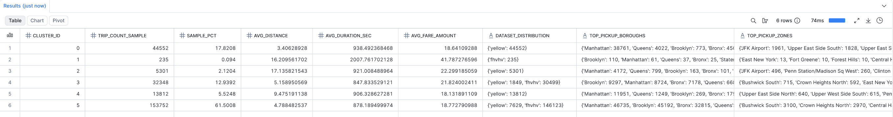

#### Clustering interpretation

- The final BIRCH result produced 6 clusters.
- Some clusters were almost completely Yellow Taxi trips, especially Manhattan-heavy and airport-related trips.
- Other clusters were mostly FHVHV trips and were more spread across Brooklyn, Manhattan, Bronx and Queens.
- One very small cluster captured rare long FHVHV trips with much higher average distance, duration and fare.
- This suggests that Yellow Taxi and FHVHV trips overlap, but they still show different usage patterns.
- Yellow Taxi trips are more Manhattan/JFK-oriented, while FHVHV trips are more broadly distributed across boroughs.

### T7. MATIC

### T8. MATIJA

- This task analyses how the emergence of FHVHV operators (Uber, Lyft, and smaller competitors) affected Yellow and Green taxi volumes, both in absolute trips and relative market share.
- All operators are tracked: Yellow taxi, Green taxi, Uber (`HV0003`), Lyft (`HV0005`), and the residual FHV "other" category (which includes smaller operators such as Juno and Via, and historically all FHV before the Feb 2019 FHVHV regulation took effect).
- Images are in `images/t8/`. No separate SQL script — analysis builds directly on the GOLD tables and SILVER views from previous tasks.

#### Note on FHV vs FHVHV and the Feb 2019 regulation

- Before February 2019, Uber and Lyft reported trips under the `FHV` dataset (as dispatching bases). When the FHVHV regulation came into effect, high-volume operators were required to report under the new `FHVHV` dataset, causing a sharp collapse in `FHV` counts and a simultaneous spike in `FHVHV`. This structural break is visible across all charts and must be accounted for when comparing pre- and post-2019 figures.
- Smaller operators (Juno `HV0002`, Via `HV0004`) appear briefly in the FHVHV data around 2019 before largely disappearing — Juno shut down in 2019, Via pivoted away from consumer rides.

#### Absolute trip volumes and market share

- Yellow taxi peaked at ~170M trips/year in 2012–2013 and has fallen steadily ever since, driven first by FHV competition (pre-2019) and then by Uber/Lyft. By 2023–2024 it handles ~40M trips/year — about 14% of its 2012 volume in absolute terms.
- Green taxi never exceeded ~20M trips/year and is now near zero, having lost its outer-borough niche to rideshare.
- FHV "other" peaked at ~260M trips/year in 2018 (capturing nearly all rideshare at the time), then collapsed after the FHVHV regulation as operators switched reporting categories.
- Post-2019, Uber holds ~175M trips/year (~57–60% market share), Lyft ~60M/year (~20–22%), Yellow ~14%, Green <1%, FHV other ~5–7%.

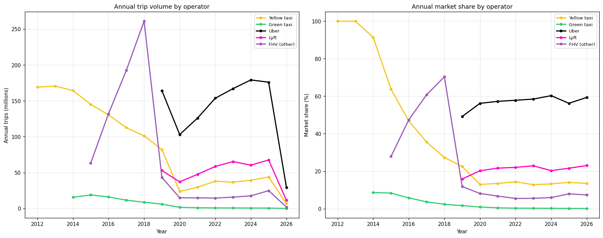

#### Monthly market share over time

- Yellow was effectively 100% of tracked trips in 2012 (only Yellow data exists). Its share declined steadily as FHV grew from 2014 onwards, crossing below 50% around 2016 and below 22% by early 2019.
- After the FHVHV regulation cutover in Feb 2019, Uber immediately emerged at ~50% share and has since stabilised at ~55–60%. Lyft holds a steady ~20–22%.
- Via and Juno are visible as thin lines just before February 2019 (~1–2% share each) and then disappear entirely.
- Green taxi's share has been in continuous decline since 2014 and is now effectively 0%.

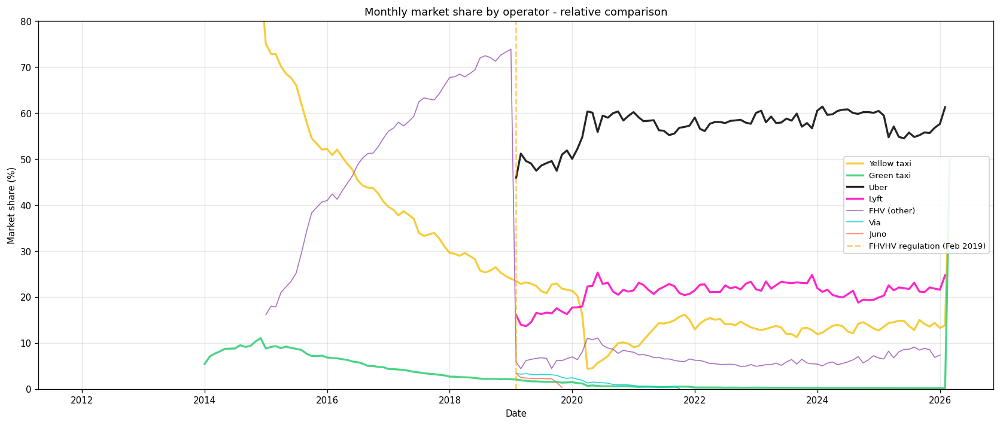

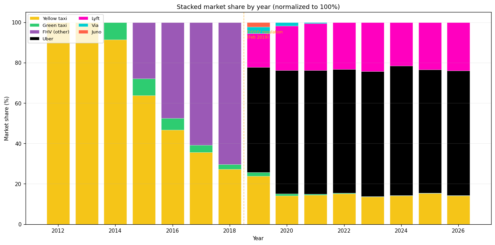

#### Annual growth rates

- Yellow declined ~10% per year consistently from 2013 to 2019, with a steep −72% crash in 2020 (COVID), then a +23% post-COVID rebound in 2021–2022, before returning to mild decline.
- Green declined faster than Yellow throughout — typically −15 to −30% per year — and its COVID crash was proportionally worse (~−75%).
- Uber and Lyft (post-2019 only) show a similar COVID crash in 2020 (~−40%) and a strong 2021 rebound (~+20–25%), then gradual stabilisation.
- The 2026 column shows extreme negative rates across all operators because only partial-year data is available.

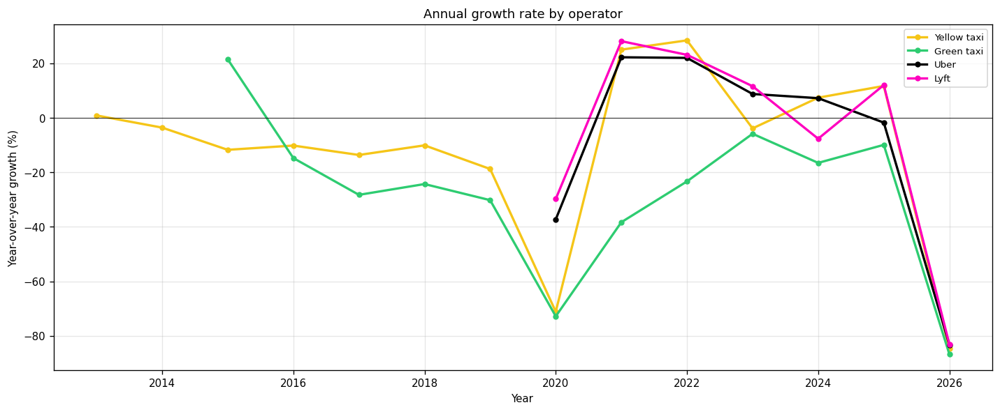

#### Before vs after FHVHV: impact on traditional services

- Comparing average monthly trips pre-FHVHV (2015–2018) vs post-FHVHV (2021–2024):
  - Yellow taxi: from ~10.5M to ~3M avg monthly trips — **−70%**
  - Green taxi: from ~1M to near 0 — **−95%**
  - FHV other: from ~13.5M to ~1.5M — **−88%** (most operators migrated to FHVHV)

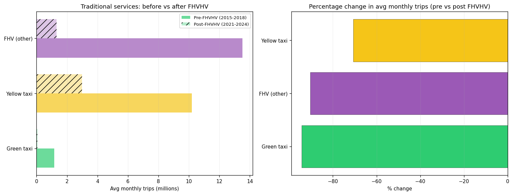

### T9. MATIJA

- Map visualizations of T2 and T4 results, rendered as choropleth maps over NYC taxi zone polygons.
- Zone geometries come from `EXTERNAL_DATA.TAXI_ZONES_GEOM` (the WKT table built in T5), exported as GeoJSON via `ST_ASGEOJSON` and parsed in Python. Maps are drawn with matplotlib polygon patches — no external map tile service needed. Scripts: `scripts/t9/t9.sql` (aggregation) and `scripts/t9/t9_map.ipynb` (rendering).

#### T2 on a map: data quality issues per zone

- A direct `SELECT *` from `SILVER.GREEN_TRIPS` would map the T4 format benchmark result, but a geographic breakdown doesn't make sense for that task (format performance is machine-dependent, not location-dependent). For T4 we instead show trip volume per zone (from T3), which is geographically meaningful and visually informative.
- For T2, the quality checks from T2 are re-applied per pickup zone against the raw (uncleaned) SILVER tables — `SILVER.YELLOW_TRIPS`, `SILVER.GREEN_TRIPS`, `SILVER.FHV_TRIPS`, `SILVER.FHVHV_TRIPS` — so the map reflects raw data quality before any filtering. Four issue types are counted per zone: zero trip distance (or trip miles for FHVHV), pickup equals dropoff, dropoff before pickup, and negative fare. These are summed into a single `TOTAL_ISSUE_PCT` column for the map color scale, normalized to the 95th percentile to avoid outliers dominating the palette. Zones with no data are shown in grey.
- The SQL for this is in `t9.sql`, which creates `GOLD.T9_QUALITY_BY_ZONE`. FHV lacks distance and fare columns, so those issue counts are hardcoded to 0 for that dataset.

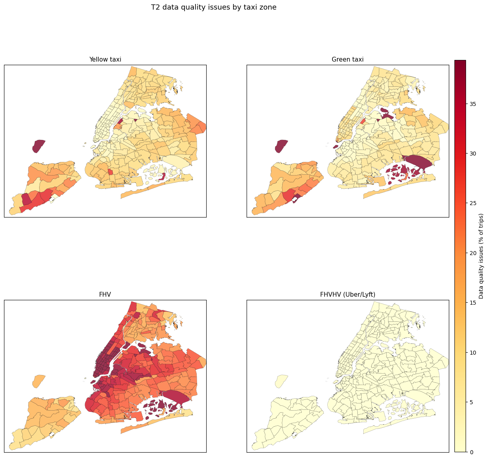

- **Yellow**: issue hotspots are concentrated in a few Manhattan zones and around the airports. Most of the city is clean.
- **Green**: scattered high-issue zones in the outer boroughs, consistent with the T2 findings about certain location IDs having outsized problem rates.
- **FHV**: large portions of the city show elevated issue rates (orange/red), especially outer boroughs — reflecting the systematic dropoff timestamp problems and missing location data identified in T2.
- **FHVHV**: mostly light/yellow across the entire city, confirming that the FHVHV dataset is by far the cleanest of the four.

#### T4 on a map: trip volume per zone

- Geographic mapping of the T4 format benchmark result doesn't make sense — format read/write speed is a property of the machine and file, not a location. Instead, we map total trip volume per pickup zone (aggregated across all years from `GOLD.T3_PICKUP_LOCATION_DIST`), which gives a geographically meaningful view of where trips originate. The color scale uses a log transform to handle the large dynamic range between Manhattan and outer-borough zones.

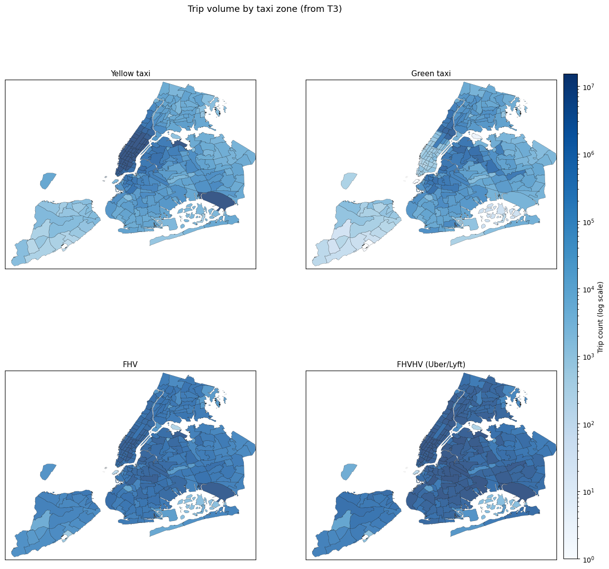

- **Yellow**: dominated by Manhattan and JFK/LGA airports. Outer boroughs are nearly empty, consistent with yellow taxi's limited reach outside Manhattan.
- **Green**: inverse of Yellow — concentrated in the Bronx, northern Manhattan, and parts of Brooklyn and Queens, exactly the outer-borough service zone Green taxi was designed for.
- **FHV**: broader geographic spread than Yellow or Green, with elevated volume across all five boroughs, though density is lower than FHVHV.
- **FHVHV**: the most geographically uniform coverage, with high volume across virtually every zone including outer boroughs, airports, and Manhattan.

### T10. MATIC
